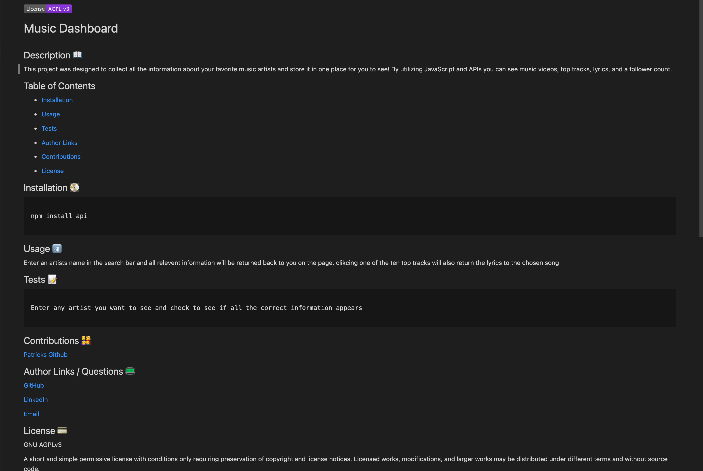

# readME Generator

## Generated File --- Click image to be taken to file in Git repository

## Summary
This application is to generate a complete and professional readME file with a few simple questions. By utilizing the inquirer package (must be downloaded to project in order to use this app) the terminal asks all necessary questions and collects the data to be formatted into the file properly. The fs built-in helper is then used to write all that information into a file all without any heavy lifting on the users end.

## Technologies Used
- JavaScript - Implemented to make use of the installed npm packages, collect user input and create a file from input based in template literals
- Inquirer - Used to ask questions to user and collect that information to be sent back to java file
- Node.js - Used to run application from command line so that all processes can run through javascript

## Walkthrough Video
[Walkthrough](https://www.youtube.com/watch?v=DintRYN6whM&ab_channel=markosanchez)

## Author Links
- [LinkedIn] (https://www.linkedin.com/in/marko-sanchez-800)
- [GitHub] (https://github.com/markosanchez800)